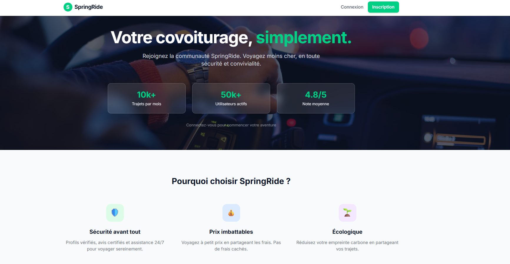
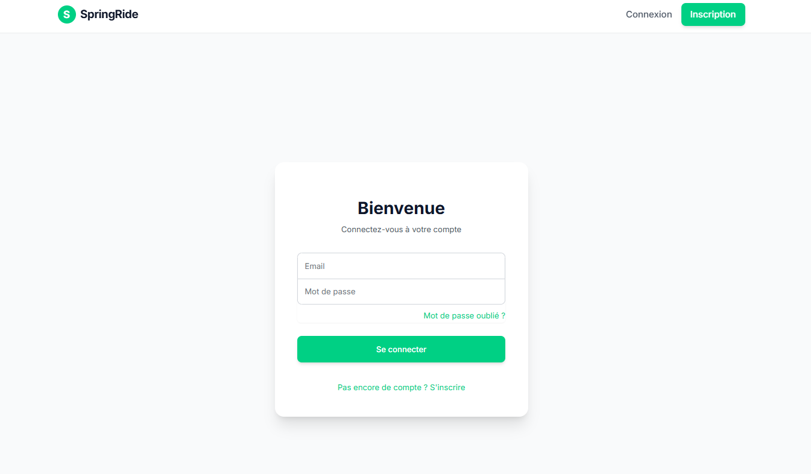
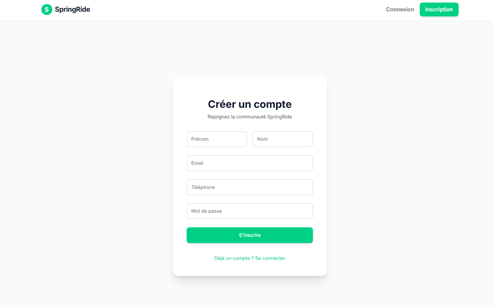
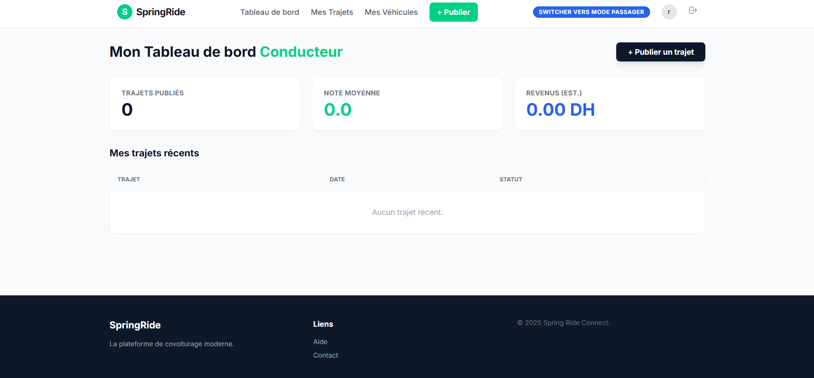
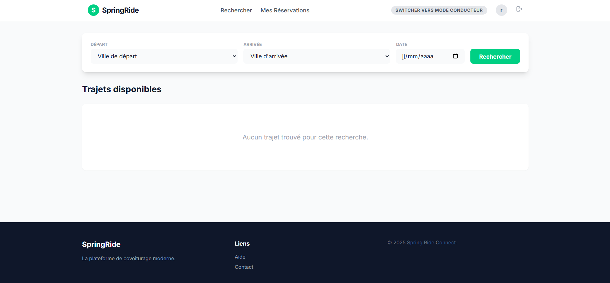
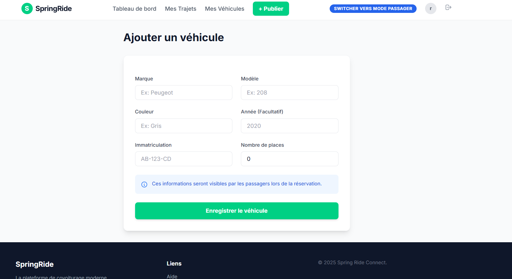

# 🚗 Spring Ride Connect

> **Spring Ride Connect** est une plateforme de covoiturage intuitive, similaire à BlaBlaCar, permettant aux utilisateurs de proposer des trajets ou de réserver des places en tant que passagers.

---

## ✨ Fonctionnalités Principales

- **Mode Passager :** Recherche et réservation de trajets.
- **Mode Conducteur :** Publication de trajets et gestion des réservations.
- **Gestion des Véhicules :** Les conducteurs peuvent ajouter et gérer leurs véhicules.
- **Authentification :** Inscription, connexion sécurisée et gestion de profil.

---

## 📸 Aperçu de l'Application

### 🏠 Page d'Accueil


### 🔐 Connexion & Inscription
| Connexion | Inscription |
| :---: | :---: |
|  |  |

### 🚗 Mode Conducteur & Passager
| Mode Conducteur | Mode Passager |
| :---: | :---: |
|  |  |

### ➕ Ajouter un Véhicule


---

## 🛠️ Technologies Utilisées

- **Backend :** Java 21, Spring Boot, Spring Data JPA, Spring Security
- **Frontend :** Thymeleaf, HTML5, CSS3, Bootstrap (ou similaire)
- **Base de Données :** MySQL / H2
- **Outil de Build :** Maven

---

## 🚀 Lancement du Projet (Local)

### 1. Prérequis
- Avoir **Java 21** installé.
- Avoir un serveur **MySQL** en cours d'exécution avec une base de données nommée `springride_db`.

### 2. Exécution

Ouvrez un terminal à la racine du projet et lancez la commande suivante :

```bash
# Sur Windows
.\mvnw.cmd spring-boot:run

# Sur Mac/Linux
./mvnw spring-boot:run
```

L'application sera accessible sur `http://localhost:8081`.

---

## 👨‍💻 Auteur
**Reda** - [whosredais](https://github.com/whosredais)
